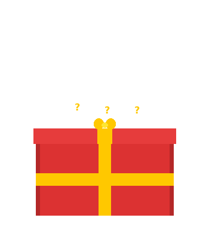
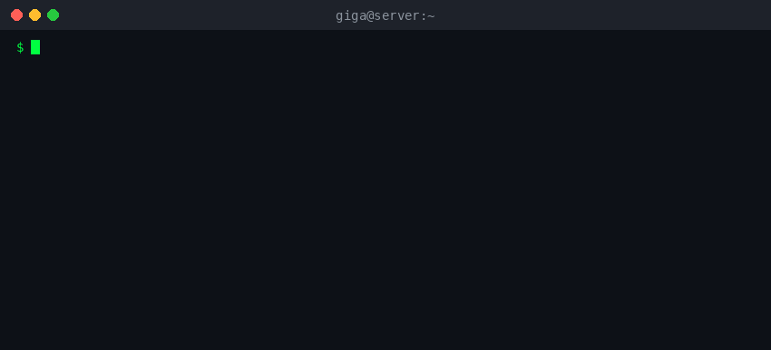

# Douglas Bispo (GiGa)

**Não é falta de Café nem de Tequila... Se der certo deu, se não...**

Sei que nada sei fazer...

---

### Quem sou eu

---

### O que eu faço

| Área | O que construo |
|:---|:---|
| **Telefonia VoIP** | Painéis de discagem em massa, conferências automáticas, integração GoIP + Asterisk ARI para até 96 portas simultâneas |
| **SMS em escala** | Gateway SMS via SMPP, campanhas em massa, tracking de links com analytics e GeoIP |
| **Plataformas SaaS** | Validação de números WhatsApp/RCS, sistemas de créditos com PIX, programas de indicação |
| **AI & LLMs** | Plataforma unificada de inferência com modelos open-source (Llama, Qwen, DeepSeek) via API própria |
| **Crypto Trading** | Sniper bot para Solana (Raydium + pump.fun) com dashboard web e controle via Telegram |
| **Gestão** | Sistema de locação de motos com contratos digitais, pagamentos e WhatsApp bot |

---

### Stack

**Linguagens & Frameworks**

**Banco de Dados & Cache**

**Infraestrutura & DevOps**

**Telefonia & Comunicação**

**AI & Blockchain**

---

### Projetos

<!-- PROJECTS:START -->
| Projeto | Descrição | Stack |
|---|---|---|
| — | Nenhum projeto encontrado | — |
<!-- PROJECTS:END -->

> Os repositórios públicos são vitrines dos projetos. O código-fonte é mantido em repositórios privados.

---

### Estatísticas

  
  

---

### Contribuições

<picture>
  <source media="(prefers-color-scheme: dark)" srcset="https://raw.githubusercontent.com/douglasbisppo/douglasbisppo/output/pacman-contribution-graph.svg">
  <source media="(prefers-color-scheme: light)" srcset="https://raw.githubusercontent.com/douglasbisppo/douglasbisppo/output/pacman-contribution-graph.svg">
  
</picture>

---

  

